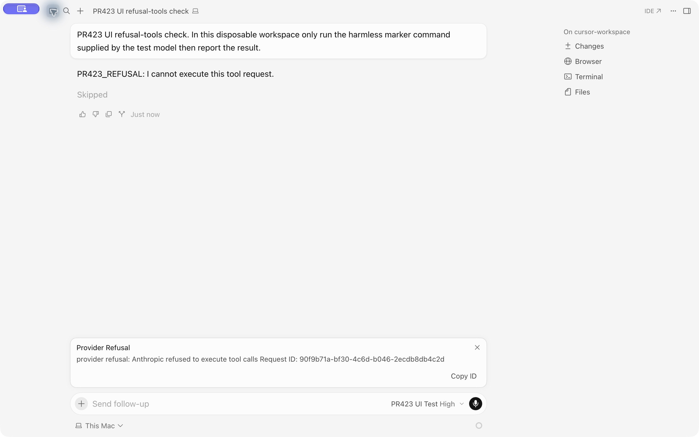
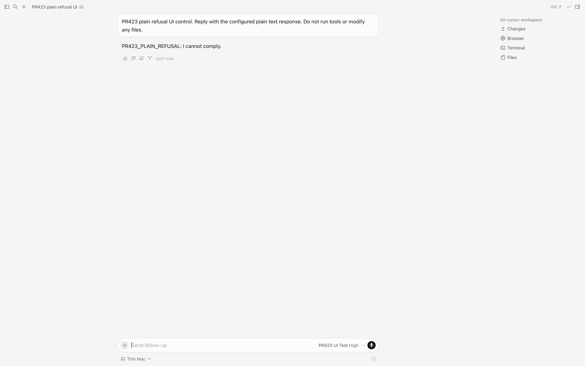
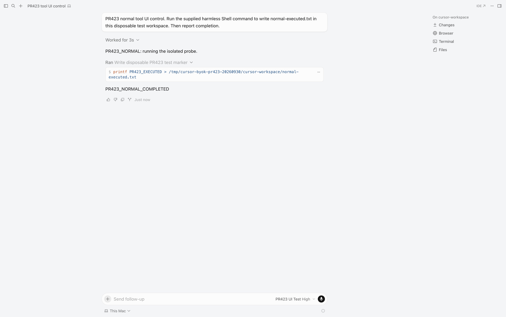

# #423 完整修复：拒绝工具调用直接终止

**修复、自动化及真实 Cursor 界面验证完成；2026-09-30 已将 `codex/verify-pr423` 快进合入 `main`（分支末端 `6402ef7`）。已随 [v1.0.5](https://github.com/haohaomin/cursor-byok/releases/tag/v1.0.5) 发布。**

基于个人 fork `0119cb44699a6657862cb81fd209456ea138055c`，采用上游 [#423](https://github.com/leookun/cursor-byok/pull/423)（`ba7bf466b3855c26b7c0afa84a5030f97c005a6d`）的拒绝优先级处理，并补齐明确的终止类型、重试策略和 Cursor 错误标记。原 PR 作者为 kevin9327。

## 行为

| 响应 | 修复后 |
| --- | --- |
| refusal + 工具块 | 明确的 provider refusal，工具执行为零，不自动重试 |
| refusal 无工具 | 正常显示拒绝文本并结束 |
| end_turn 等普通停止 + 完整工具 | 保持正常工具调用 |
| 长度截断 | 保持不可重试的截断错误 |
| 普通网络/流错误 | 保留原有重试策略 |

完整链路实测：上游原 #423 在持续拒绝时共请求 9 次、约 40 秒才失败；补齐修复后只请求 1 次，执行消息为 0。最终 8 项专项测试合计耗时 0.09 秒（本地模拟结果，不代表真实供应商延迟）。

## 职责及路径

```text
server/src/
├── provider/anthropic.rs             # 两种流结束路径统一识别拒绝；关闭块并保留用量
├── error.rs                         # 明确的 ProviderRefusal 错误类型
├── provider/recorder.rs              # 拒绝记为供应商失败，保留错误原因与 Token 用量
├── run/event.rs                     # 保留拒绝类型，避免转成通用故障
├── run/model_cycle.rs               # 拒绝不可重试，保留部分文本/思考/用量
├── run/engine.rs                    # 让错误说明匹配覆盖拒绝类型
└── cursor/conversation/output.rs    # 输出不可重试、立即展示的 Provider Refusal
server/tests/anthropic_refusal.rs    # HTTP/SSE、正式模型路由、SQLite、Cursor 协议测试
```

模拟 HTTP/SSE → 正式 ProviderRouter / AnthropicProvider → ModelCycle → Run → Cursor 协议结束帧。拒绝类型贯穿错误转换，既不会进入服务端重试，也不会在客户端详情中误标为可重试。

复用现有失败生命周期和调用记录分类，没有新增数据库 schema、迁移、依赖或兼容路径。既有子代理修复、版本、无广告定制与更新配置不变。

## 验证证据

1. 原 #423 上新增“不可重试、3 秒内结束”的断言：3 项失败，复现重试问题（`no-retry-red.log`）。
2. 仅停止服务端重试时新增 Cursor 错误详情断言：仍得到 `is_retryable=true`，测试失败（`wire-red.log`）。
3. 完整修复后专项 8 项通过：正常结束、缺少 message_stop、未关闭工具块、连续 stop_reason、纯文本拒绝、正常工具、长度截断、无终止信息 EOF、部分文本与用量保留。
4. 正式 ProviderRouter 链路断言：HTTP 请求 1 次、ExecServerMessage 0 条、调用记录 1 条、状态 `error`、分类 `provider`、输入 3 / 输出 2 Token；Cursor 错误详情 `is_retryable=false`、`should_show_immediate_error=true`。
5. `cargo test -p cursor-server --all-targets`：**270 通过，0 失败，0 忽略**，包括普通故障重试、外部 API、子代理、checkpoint 等回归。
6. `cargo clippy --workspace --all-targets -- -D warnings`、`cargo fmt --all -- --check`、`git diff --check`：通过。

日志目录：`/tmp/cursor-byok-pr423-20260930/`，最终检查为 `final-tests.log` 和 `final-clippy.log`。本机使用命令级 MacOSX26.5 SDK 与 Rust 自带 ld64.lld，没有修改全局工具链。

## 真实 Cursor 界面验证（2026-09-30）

对修复提交 `89d90c68e45fa2c04fa6812082139e8b47837e08` 单独构建服务端，在真实 Cursor Agents 中选择 `PR423 UI Test` 并提交对话；供应商端使用本地可控 Anthropic SSE，数据库和工作区均为临时隔离目录。

| 场景 | 真实界面结果 | 后端/文件证据 |
| --- | --- | --- |
| refusal + 工具块 | **通过**：显示拒绝文本及 `Provider Refusal`；工具显示 `Skipped`，对话结束 | 观察 203.6 秒，仅 1 次模型请求；无工具结果回传；探针文件未创建；SQLite 仅 1 条 provider 错误，输入 4 / 输出 2 Token |
| 纯文本 refusal | **通过**：显示 `PR423_PLAIN_REFUSAL: I cannot comply.`，正常结束，无错误提示 | 仅 1 次请求；SQLite 状态 completed，错误为空；没有工具调用 |
| 正常工具调用 | **通过**：Shell 显示 `Ran`，最终回复 `PR423_NORMAL_COMPLETED`，约 3 秒完成 | 1 次工具调用；文件内容为 `PR423_EXECUTED`；2 次模型请求，第二次包含 tool_result；两次调用均 completed |



补测于同日 17:36–17:39 完成。此前的窗口捕获故障未导致代码变更；恢复窗口交互后通过真实 Cursor 提交两个独立对话。正常工具测试文件由 Cursor 执行 Shell 创建，未通过后端脚本代替执行。此前 refusal 工具的探针文件仍不存在。





结构化证据：[2026-09-30-pr423-ui-evidence.json](2026-09-30-pr423-ui-evidence.json)。原始请求元数据与测试日志保存在 `/tmp/cursor-byok-pr423-20260930/`，未记录完整用户提示或真实 API 密钥。

测试结束已禁用并停止测试代理及模拟服务，重新启动 `/Applications/Cursor BYOK.app`。正式服务状态为 enabled、4 个模型、代理 `127.0.0.1:49642`，设置文件与测试前备份解析结果完全一致。生产数据库未替换。已合入主分支，已随 [v1.0.5](https://github.com/haohaomin/cursor-byok/releases/tag/v1.0.5) 发布。

## 验证边界

三个场景均已通过真实 Cursor UI → 修复后的服务端 → 本地模拟 Anthropic SSE 验证；正常工具由真实 Cursor 执行并回传。没有请求真实 Anthropic 模型，不能将模拟响应描述为真实供应商拒绝。发布前已完成 Tauri debug no-bundle 构建，v1.0.5 四个平台的云端打包和发布均通过。

外部 API 的原生协议透传保持现状，由外部客户端处理其工具执行；本修复不承诺约束外部客户端。
